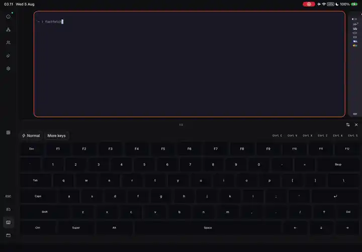

<p align="center">
  <picture>
    <source media="(prefers-color-scheme: dark)" srcset="brand/svg/mark-on-dark.svg">
    
  </picture>
</p>

<h1 align="center">lwfa</h1>

<p align="center"><strong>literally work from anywhere</strong></p>

<p align="center">
  <a href="https://github.com/ngodn/lwfa/releases"></a>
  <a href="LICENSE"></a>
  
</p>

**Run your Linux desktop from any browser.** lwfa is a self-hosted remote
desktop for Wayland. It runs as an ordinary window inside the compositor you
already use, and serves that session to a browser on any other device: an iPad,
a laptop, a phone. Video is hardware-encoded H.264 or HEVC, one stream per
window, decoded with WebCodecs. Audio is Opus. Keyboard, mouse, touch and an
on-screen gamepad the machine sees as a real controller all come back the other
way.

There is **nothing to install on the client**. It is a browser tab, or a home
screen icon if you add it as a PWA.

<p align="center">
  <a href="https://github.com/ngodn/lwfa/raw/master/docs/demo.mp4">
    
  </a>
</p>

<p align="center"><sub>
  An iPad driving a desktop in another room: a terminal on the on-screen
  keyboard, video in Firefox, the controller layout being edited while a game
  runs behind it, and that game played through the on-screen pad.
  <a href="https://github.com/ngodn/lwfa/raw/master/docs/demo.mp4">Watch the full clip, with sound</a>.
</sub></p>

## What makes it different

- **One video stream per window, not one per screen.** The browser composites
  real DOM elements, so the shell lays windows out for the device in your hand
  rather than letterboxing a 16:9 desktop onto a tablet.
- **Nothing to install on the client.** Any browser with
  [WebCodecs](https://developer.mozilla.org/en-US/docs/Web/API/WebCodecs_API).
  Add it to an iPad home screen and it runs edge to edge like an app.
- **It is a compositor, so the layout is real.** Scrollable tiling, following
  [niri](https://github.com/niri-wm/niri): the tablet is not driving a mouse
  around a desktop built for a monitor.
- **Nested on purpose.** lwfa is a client of Hyprland, niri, KWin or whatever
  you run. Starting it cannot take down the session you were working in, and it
  is not a session you log into.
- **Games work.** Steam and Proton run under XWayland in the same strip, and the
  on-screen controller is a real `/dev/uinput` device, so games find it the way
  they find a plugged-in pad.

## How it compares

| | What it is best at | Where lwfa differs |
|---|---|---|
| [Sunshine](https://github.com/LizardByte/Sunshine) + [Moonlight](https://moonlight-stream.org/) | Game streaming, the lowest latency, native clients everywhere | lwfa needs no client app, and streams windows individually rather than one screen |
| noVNC, TigerVNC | Runs against almost anything, no GPU required | lwfa uses hardware video encode and decode, carries audio, touch and a gamepad, and does not send a whole framebuffer |
| xrdp, RDP | The mature choice for a full remote login session | lwfa shares the machine you are already using instead of starting a session beside it |
| RustDesk, AnyDesk | Remote support: see and drive somebody else's screen | lwfa is for your own machine, and rearranges it for the screen you are on |

If you want the lowest possible latency for one game on a device you can install
software on, use Moonlight. lwfa is for the case where you want the *whole
desktop*, on whatever device is nearby, without installing anything on it.

## Install

Releases are a single self-extracting file. Download the latest from
[Releases](https://github.com/ngodn/lwfa/releases):

```sh
chmod +x lwfa-*.run
./lwfa-*.run
```

It looks at the machine first (distribution, compositor, GPU, Xwayland, audio,
`/dev/uinput`), shows what it is about to write, and asks. Then it prints a link
with the password already in it.

Needs glibc 2.31 or newer, which means Debian 11+, Ubuntu 20.04+, Fedora 32+,
RHEL 9+ and every rolling distribution. Full detail, including building from a
checkout: [docs/install.md](docs/install.md).

## Quick start

```sh
systemctl --user start lwfa          # or: cargo run -p lwfa-engine
```

Open the link it prints on the device you want to use, and bookmark it. For
anything beyond your own machine you want TLS, because browsers refuse hardware
video decode on an insecure page; if you have Tailscale, that is one command:

```sh
tailscale serve 6733
```

[docs/remote-access.md](docs/remote-access.md) covers that, the container with
nginx, and bringing your own reverse proxy.

## What works today

Daily-driven: a gaming PC in one room, an iPad on the couch, Steam games under
Proton played over wifi with the on-screen controller.

- Per-window hardware video (NVENC), decoded with WebCodecs, zero-copy from the
  GL texture into the encoder when the NVIDIA driver allows it
- Adaptive bitrate driven by real socket backpressure, up to 32 Mbit/s, with the
  focused window getting the budget and unwatched windows paused
- Audio over Opus, per-device opt-in, quality that degrades last
- Keyboard, mouse, touch (long press for right click) and an on-screen gamepad
  that is a real `/dev/uinput` controller on the machine
- XWayland, so Steam, Proton and everything X11 runs in the same strip
- Sessions that survive their own network: a wifi blip costs nothing visible,
  45 seconds of grace, the controller stays in the game's hands
- One clipboard across the session, the desktop outside it and every connected
  device, text and files alike, with a history you can put anything back from
- Accounts in SQLite, watch-only or interact, per-app launch permissions,
  enforced in the engine
- Multi-device: one client drives, the rest watch, control is taken explicitly
- Installs as a PWA, edge to edge on an iPad
- Ships as one self-extracting file with an installer that detects the machine
  before it writes anything

Deliberately not done yet: built-in TLS (terminate it at a reverse proxy),
multi-monitor, DPI awareness, the layer-shell chrome path for the native output,
and a TTY backend. The engine runs nested inside an existing compositor; it does
not own a display outright.

## Documentation

| | |
|---|---|
| [Install](docs/install.md) | Releases, building from a checkout, requirements, what the installer writes |
| [Running](docs/running.md) | Nested and development modes, keyboard shortcuts, scrollable tiling |
| [Configuration](docs/configuration.md) | The config file, precedence, every environment variable |
| [Remote access](docs/remote-access.md) | Another device, TLS, reverse proxies, the iPad home screen |
| [The shell](docs/shell.md) | Navigation rail, on-screen keyboard and gamepad, audio, clipboard |
| [Streaming](docs/streaming.md) | Codecs, zero-copy capture, how the bitrate follows the network |
| [Playing games](docs/gaming.md) | Steam, Proton, the virtual controller, X11 by hand |
| [Accounts](docs/accounts.md) | Shared password, named users, permissions |
| [Architecture](docs/architecture.md) | The decisions and why. Read this before changing anything structural |
| [Testing](docs/testing.md) | Test commands, protocol fixtures, the spring parity contract |
| [Releasing](docs/releasing.md) | Cutting a release, and why it builds in a container |

[docs/macos.md](docs/macos.md) and [docs/windows.md](docs/windows.md) are
research on what supporting those hosts would actually take. Neither is built.

## How it is built

- **Engine**: Rust, [Smithay](https://smithay.github.io/), running nested in a
  host compositor. Wayland plus XWayland, per-window NVENC encode, PipeWire
  audio capture, a uinput virtual gamepad. Owns mechanism, not policy.
- **Shell**: TypeScript, React 19, [shadcn/ui](https://ui.shadcn.com/) on
  Tailwind v4. Owns layout policy and everything the user touches.
- **Protocol**: one WebSocket, one port. JSON messages for control, binary
  frames for video and audio, with a decoder on each side that rejects anything
  it did not expect. Fixtures round-trip between Rust and TypeScript in both
  directions so the two halves cannot drift.
- **Layout**: scrollable tiling. Columns on an infinite strip, workspaces
  stacked vertically.

```sh
mise install && pnpm install
pnpm run build && cargo run -p lwfa-engine
pnpm run test:all
```

## Brand

The mark, wordmark lockups, favicons and PWA icons live in [brand/](brand/),
with usage rules in [brand/README.md](brand/README.md). The shell references
them directly; if you fork this, that is the one directory to replace.

## Licence

MIT. See [LICENSE](LICENSE).

One thing to keep in mind while working: [niri](https://github.com/niri-wm/niri)
is GPL-3.0, and lwfa follows its layout model (architecture doc, section 2.3).
Reading niri as a reference is fine and encouraged. **Porting its code is not**,
because that would force lwfa to GPL-3.0. If that ever looks worth doing, it is
a deliberate relicensing decision to make first, not a consequence to discover
afterwards.
